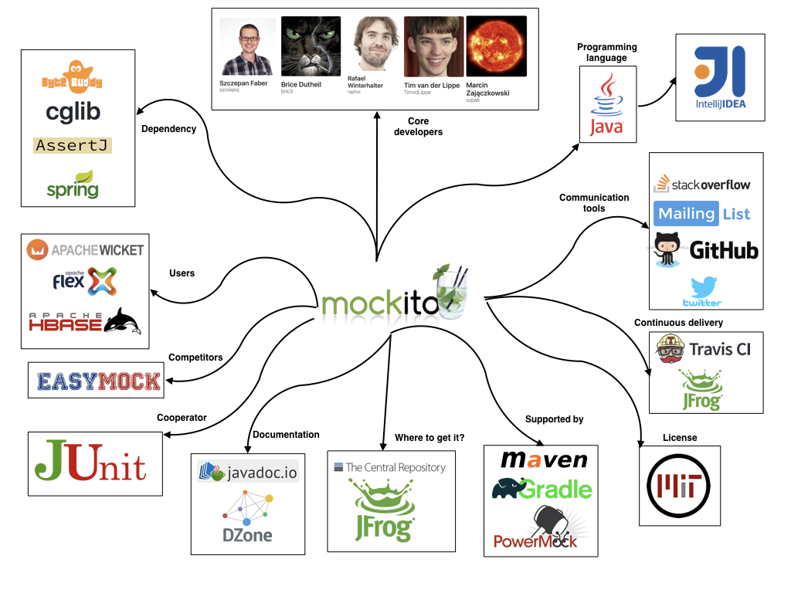
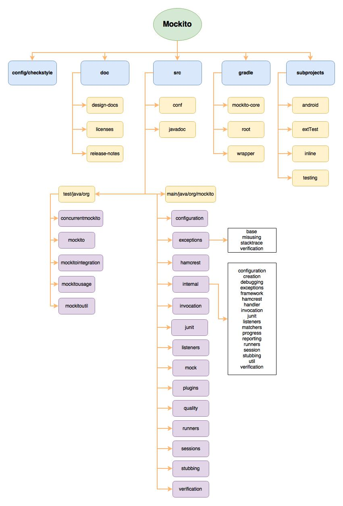
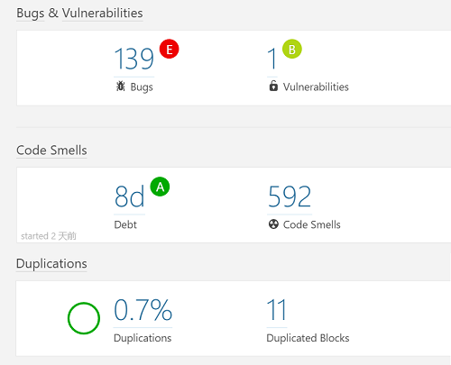
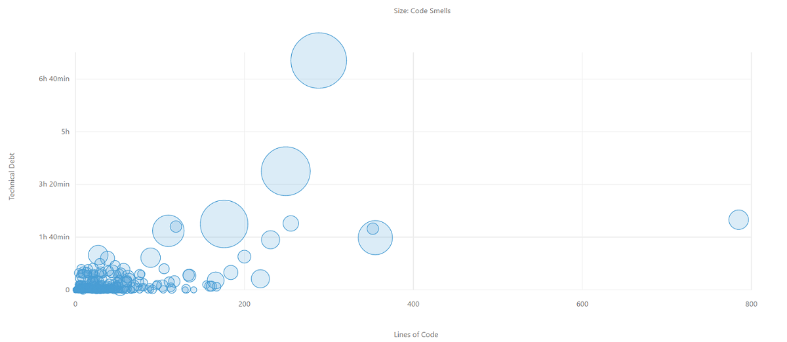
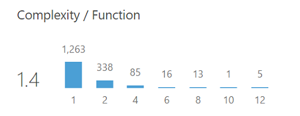
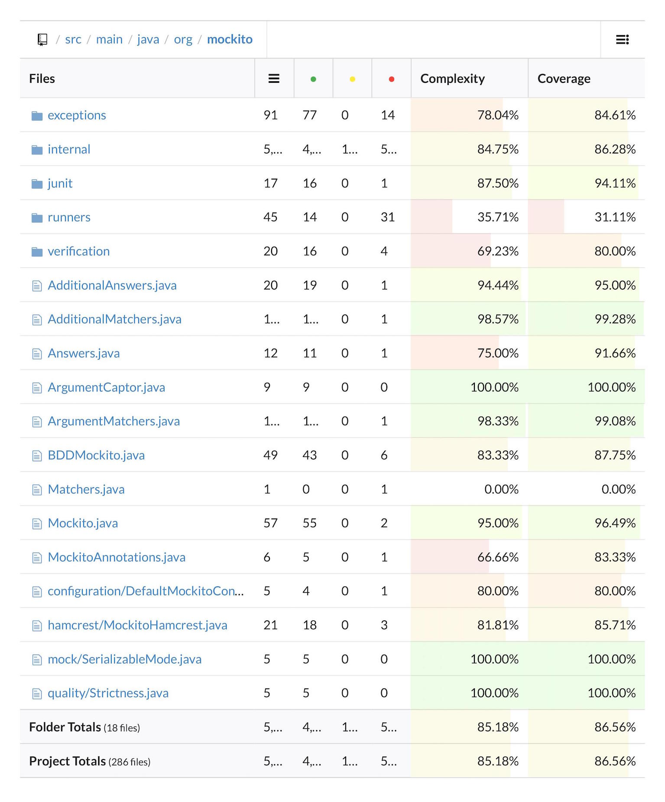
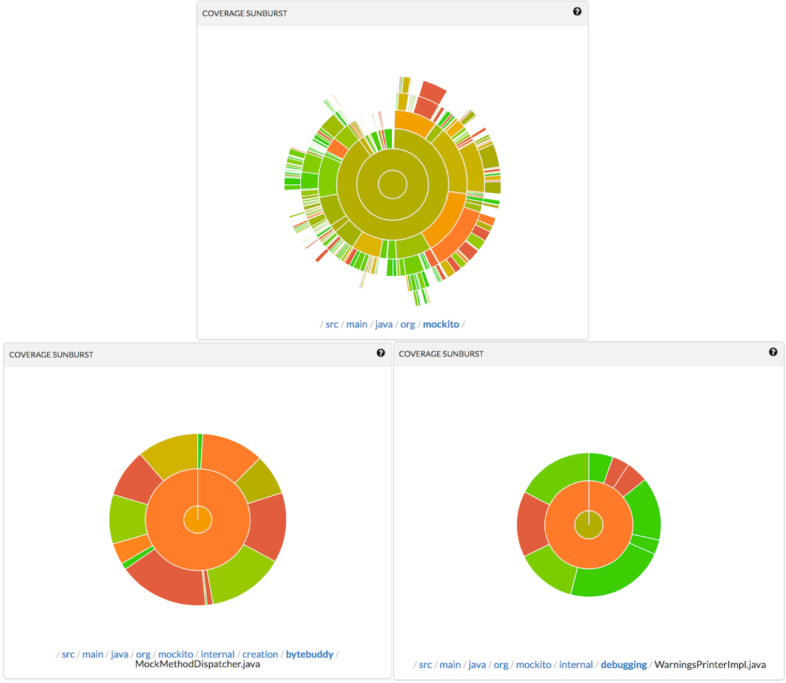
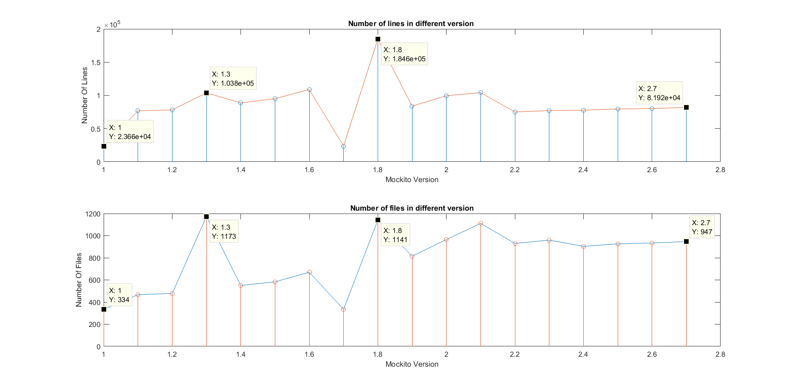
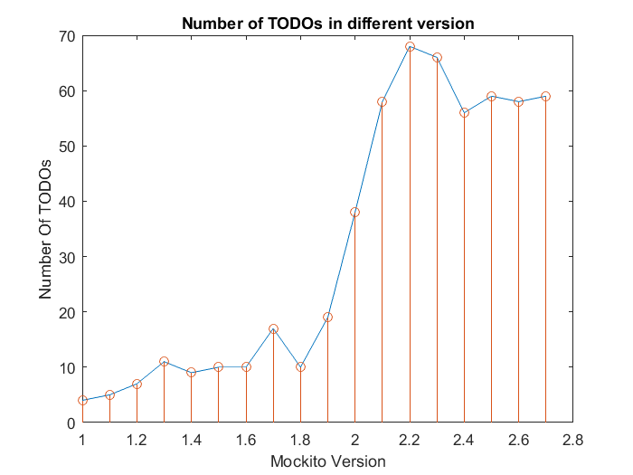

# **Mockito - the most popular mocking framework**
By @[Xin Liu](https://github.com/L-KID),
@[Lu Liu](https://github.com/Nirvanall),
@[Saiyi Wang](https://github.com/SaiyiW),
and
@[Xiang Teng](https://github.com/Andyteng)   
*Delft University of Technology*


## Abstract  
*Mockito is the most popular mocking framework for unit test in Java [[2]](#Reference). It is famous for its compact and effective
APIs and widely used by Java developers all over the world. Mockito is an open source project
living in [GitHub](https://github.com/mockito/mockito) and it is being maintained and developed by
the core developers as well as quite a few external contributors. In this chapter, we study the software architecture
of Mockito in the following aspects: stakeholder analysis, context view, development view, functional view, evolution perspective,
future release perspective and technical debts. The study goes from a high-level analysis to
more technical views and perspectives. In this process, we find Mockito is a very well organized project with
high maintainability, readability and extensibility.*


## Table of Contents  
1. [Introduction](#Introduction)  
2. [Stakeholder Analysis](#Stakeholders)  
      2.1 [Identification](#identification)  
      2.2 [Power interest matrix](#power)   
      2.3 [Integrators](#Integrators)  
3. [Context View](#Context)  
      3.1. [External entities](#External_entities)  
      3.2. [Context view diagram](#Context_view_diagram)  
4. [Development View](#Development_View)    
      4.1 [Module Organization](#Module_Organization)  
      4.2 [Common processing](#Common_processing)   
      4.3 [Codeline Organization](#Codeline_Organization)  
      4.4 [Release Process](#Release_process)
5. [Functional View](#Functional_view)  
      5.1 [Functionalities](#Functionalities)  
      5.2 [Functional Structure Model](#Functional_structure_model)  
6. [Evolution Perspective](#Evolution_perspective)  
7. [Future Release Perspective](#Future_release_perspective)  
8. [Technical Debts](#Technical_debts)   
    8.1 [Automated inspecting code debts with tool](#Automated)      
    8.2 [Testing Debts](#Testing_debts)     
    8.3 [Evolution of Technical debt](#Evolution)   
9. [Conclusion](#Conclusion)  
10. [References](#Reference)  

<a name="Introduction"></a>
## Introduction

In software development, unit tests are necessary to indicate whether small sections fit for work.
In Java, these sections are usually a class or just a method. Mocking is a primary approach in unit test.
In a unit test, developers only want to verify the correctness of a specific object.
However, it usually has dependencies on other objects, which may be
impractical to be called in a unit test.
Mocking the dependencies and simulating their behaviors solve the problem.  
The first release of Mockito ([version 0.9](#https://github.com/mockito/mockito/archive/v1.7-rc1.zip)) was in 2008. Mockito has released many versions since its continuous
release model implemented. Till March 2017, the version of Mockito is 2.x, and the Mockito team is [planning for releasing
Mockito 3](https://github.com/mockito/mockito/wiki/What%27s-new-in-Mockito-2).
Mockito is voted as the best mocking framework for java by massive StackOverflow community, which is
due to its feature of letting users write beautiful tests with a clean and simple API [[2]](#Reference).

Four TU Delft students from DESOSA (Delft Students on Software Architecture) [[3]](#Reference) group have made a deep analysis on architecture of Mockito based on
the theory of software architecture referring to the book *Software Architecture* of Ronzanski & Woods [[1]](#Reference).
There are several viewpoints and perspectives mentioned in this book.
The chapter starts with the analysis of stakeholders who are involved in the development of this project,
followed by context view about the relationship and interactions between Mockito and its environment.
After that development view shows the modular structure of the system,
while functional view shows the functionalities of Mockito and how modules implement all the required features.
The evolution perspective talks about the ability of the system to be flexible
in the face of the inevitable change that all systems experience after deployment.
And future release perspective shows the improvement of method and model in the future versions.
At last, technical debt analyzes how well Mockito is implemented.

<a name="Stakeholders"></a>  
## Stakeholder Analysis  

In traditional software development process, the parties related to this are specified at the beginning. Different users are interested in different aspects of the software architecture. These users are defined as stakeholders. Some important stakeholders of Mockito are tabulated in Table 1. These stakeholders are categorized in 8 groups according to chapter 9 of the book Software architecture of Rozanki & Woods(2012) [[1]](#Reference).  In addition, an analysis of their associated levels of power and interest is shown in Figure 1.

<a name="identification"></a>
### Identification
Mockito is an open-source testing framework started by @[Szczepan Faber](https://github.com/szczepiq) in early 2008. He is the main developer in the early stage. Currently Mockito is maintained by @[Szczepan Faber](https://github.com/szczepiq), @[Brice Dutheil](https://github.com/bric3), @[Rafael Winterhalter](https://github.com/raphw), @[Tim van der Lippe](https://github.com/TimvdLippe) and other developers. [Travis CI](https://en.wikipedia.org/wiki/Travis_CI) and [Bintrary](https://bintray.com/szczepiq/maven/mockito/view) are used to facilitate continuous delivery.
<a id="table1"/>  

Table 1. Stakeholders of Mockito

| Stakeholder | Description |
|------------------------|-------------|
| Developers & Testers| In the early stage, the main developers are @[Szczepan Faber](https://github.com/szczepiq) and his friends. Currently Mockito is maintained by the core development team consisting of @[Szczepan Faber](https://github.com/szczepiq), @[Brice Dutheil](https://github.com/bric3), @[Rafael Winterhalter](https://github.com/raphw), @[Tim van der Lippe](https://github.com/TimvdLippe) and other 89 external contributors (as of 21th of February 2017) on [Mockito](https://github.com/mockito/mockito).  
|Maintainers | As this is an open source and non-commercial software, therefore, most of the maintainers are the contributors of the GitHub and the core development team. For instance, @[Christian Schwarz](https://github.com/cschwarz) and @[Pascal Schumacher](https://github.com/PascalSchumacher) are two main external contributors.|
| Assessors | According to the closed issue in [Mockito](https://github.com/mockito/mockito), it could be asserted that the main assesors come from the core development team which consist @[Szczepan Faber](https://github.com/szczepiq), @[Tim van der Lippe](https://github.com/TimvdLippe), @[Brice Dutheil](https://github.com/bric3) and a few others. |
| Communicators |There are several ways that have been used to explain the system to the other stakeholders such as [Dzone Reference Card](https://dzone.com/refcardz/mockito), [Javadoc(Mockito 2.7.10 API)](http://static.javadoc.io/org.mockito/mockito-core/2.7.10/org/mockito/Mockito.html), Twitter and the [Blog](http://blog.mockito.org/). For the blog, it is governed directly by @[Szczepan Faber](https://github.com/szczepiq). Before 2017, the most information is written on [LinkedIn](https://www.linkedin.com/in/szczepiq/recent-activity/posts). The documentation on DZone is written by @[Marcin Zajączkowski](https://github.com/szpak).  |
| Suppliers | [Dexmaker](http://stackoverflow.com/questions/tagged/dexmaker) is used by Mockito to support Android users. [PowerMock](https://github.com/powermock/powermock) is used to test code that is normally regarded as untestable by Mockito. Another tool that is used to manage project is called [Maven](https://maven.apache.org/). However, the actual building tool is [Gradle](https://gradle.org/). Moreover, IntelliJ IDEA is used by developers.|
| Users | Two main utilize places of Mockito are in creating a unit test and to simplify and enhance the integration tests respectively. [Here](https://github.com/mockito/mockito/wiki/Mockito-In-Use) are some projects that use Mockito in late 2010. Such as Sonar, EHcache, Dozer and so on. Some companies or commercial products also use it such as [Atlassian](http://blogs.atlassian.com/developer/2009/01/how_to_make_writing_unit_tests.html) or [Grid Dynamics](http://blog.griddynamics.com/2010/03/mocking-with-mockito-and-powermock.htm). The recent versions also support Android via [Dexmaker](http://stackoverflow.com/questions/tagged/dexmaker). |

### Additional types of stakeholders
* <a name="additional"></a>Competitor:
[EasyMock](http://easymock.org/), in fact, Mockito is a framework which is grown out from it.
* Cooperator: [JUnit](http://junit.org/junit4/) is an important collaborating framework of Mockito. It is a simple framework to write repeatable tests.
[TestNG](http://testng.org/doc/index.html) is a testing framework inspired from JUnit and NUnit but introduced some new functionalities that make it more powerful and easier to use.
* Dependency: [Spring](https://spring.io/), [ByteBuddy](http://webcache.googleusercontent.com/search?q=cache:http://bytebuddy.net/&gws_rd=cr&ei=l4niWMHFDsizacP-usAE#/), [CGLib](https://github.com/cglib/cglib/wiki) and [AssertJ](http://joel-costigliola.github.io/assertj/).

### Power interest matrix
The power and interest on Mockito of each group is obvious by viewing the position in the Figure 1. The most important party of the stakeholders is the core developer team. It has high power as it makes the majority decisions in Mockito. The reason why they also have high interest is that they are the main contributors. The second group needing mention is the third-party dependencies. Mockito is an open source project which has a high-level dependency on third-party libraries. The details could be found in Table 1. So, they have high power in Mockito, however, they are not so interested in Mockito. The last group needed to be shown is users. It is the group having low power (only a few of them are contributors) and high interest (their products directly rely on the functionalities of Mockito).


Figure 1. Power interest matrix

<a name="Integrators"></a>
### Integrators  
In this section, the integrators who deal with the contributions and
decide whether to merge them or not are identified. Also, how a decision is made about pull requests is discussed in details.

#### Identification  
According to the activities regarding reviewing and merging recent pull requests, we identify @[TimvdLippe](https://github.com/TimvdLippe)
as the main integrator, while @[bric3](https://github.com/bric3) and @[szczepiq](https://github.com/szczepiq) also review
the pull requests frequently.   
@[TimvdLippe](https://github.com/TimvdLippe) takes part in reviewing most of the pull requests in
recent time due to [some reasons](https://github.com/mockito/mockito/issues/950#issuecomment-280363810). He makes
decision himself on small changes like minor optimizations and refactoring. When the pull requests have obvious influence on the
code he would invite other core members to review together. He also friendly helps the external contributors to
rebase their PRs to meet their format and style requirements. On the other hand, @[bric3](https://github.com/bric3) and @[szczepiq](https://github.com/szczepiq)
also show up frequently to help to review the pull requests and give suggestions.  

#### Challenges  
The integrators often hold different opinions towards a single pull request. For instance, in [#932](https://github.com/mockito/mockito/pull/932),
@[TimvdLippe](https://github.com/TimvdLippe) and @[szczepiq](https://github.com/szczepiq) were in favor of the change while @[bric3](https://github.com/bric3)
thought the issue was more like a GitHub bug and he preferred not to fix it themselves. Another example is [#942](https://github.com/mockito/mockito/pull/942)
where @[TimvdLippe](https://github.com/TimvdLippe) hoped to see more tests specifically for Java8 before merging it, while @[szczepiq](https://github.com/szczepiq)
thought it was more desirable to forward the pull request even without the tests. We can then tell that integrators
indeed have an issue with reaching consensus.

#### Merge Decision Strategy  
When the integrators want to merge a pull request, they mainly care about the source code quality and code style of the incoming pull request. For example, pull request [#955](https://github.com/mockito/mockito/pull/954) is about modifying the code related to the release warning displaying, which has a satisfied code quality and therefore has been merged.
Moreover, the integrators also consider the commit set and whether it adheres to the project conventions for submitting pull requests.
Besides, the integrators will judge whether the pull request fits the project roadmap and the technical design of the project.
Interestingly, we also found that there is no difference in treatment of pull requests from the core team or from the project's community.

<a name="Context"></a>
## Context View

With the service supplied by Mockito, users can write unit tests for Java projects.
Users can search for how to use Mockito through Javadoc, release notes or Dzone.
There are some related projects that are for the unit tests for other programming languages such as Python
, Flex, Javascript, Scala, Objective C, Perl, PHP, MATLAB, TypeScript, and Dart.
 Also there are some extensions for Mockito such as
[Junit 5 mockito extension](https://github.com/junit-team/junit5-samples/tree/master/junit5-mockito-extension) and [Spock subjects-collaborators extension](https://github.com/marcingrzejszczak/spock-subjects-collaborators-extension).  

[Figure 2](#figure2) presents the context of Mockito including relationships, dependencies, and interactions between the framework and its environment.
This environment includes the people, systems and external entities.  

<a name="External_entities"></a>
### External entities
There are several entities in Mockito, and together they set up the environment of it.
The external entities are listed below:

* Developing language: Java
* IDE for programming: IntelliJ IDEA
* Communication tools: Stack overflow, Mailing-List, GitHub, twitter
* Continuous delivery tools: Travis CI, Bintray
* Supported by: Maven(lastly), Gradle(primarily), [PowerMock](https://github.com/powermock/powermock)
* License support: MIT license
 integration tests that use Mockito as end-user
* Documentation: Javadoc.io, DZone
* Users: [Sonar]( http://www.sonarsource.org/), [Ehcache](http://ehcache.org/), [Dozer](http://dozer.sourceforge.net/ ), [Apache Wicket](http://wicket.apache.org/ ), [Spring Integration](http://www.springsource.org/spring-integration), [Apache Felix](http://felix.apache.org/), [HBase](http://hbase.apache.org/), etc.
* Competitors: [EasyMock](http://easymock.org)
* Collaborating testing framework: JUnit
* Dependency: [Bytebuddy](http://bytebuddy.net/#/), [Spring](https://spring.io), [CGLib](https://github.com/cglib), [AssertJ](http://joel-costigliola.github.io/assertj/)


<a name="Context_view_diagram"></a>
### Context view diagram
The diagram below shows the context view of Mockito.
It contains the external entities and the most important stakeholders mentioned in Stakeholder Analysis section.

<a name="figure2"/>



Figure 2. Context view diagram

From the context view diagram, both entities and important stakeholders are revealed.
The core developers in the diagram consist the development team.
They created Mockito, contribute to and maintain the whole project mostly.
In the development process, the communication tools are used as communication platform of developers and platform
to convey the information of the system to other stakeholders.
The programming language is mainly Java and the IDE used is IntelliJ IDEA.
When developing, the dependencies mentioned above are the base of the project, and used as library or framework of the system.
Travis and Bintray serve for continuous delivery.

Apart from development, the access of Mockito is another crucial part in context view.
To know detailed information of Mockito such as the examples of testing code, users are supposed to read Javadoc and DZone.
To get the Mockito package, users can check the Maven Central Repository or Bintray.
To use Mockito, Gradle is primarily required, but projects built with Maven are also supported.

The source code of Mockito and the associated documentation files are licensed under the MIT license.

<a name="Development_View"></a>
## Development View

As mentioned in the book written by Rozanki & Woods(2012)[[1]](#Reference),
>The development view of a system describes the architecture that supports the software development process.

This section is about development of Mockito.
Development view supports the design and build of software for complex systems.
It includes module organization, common processing, and codeline organization.


<a name = "Module_Organization"></a>
### Module Organization
Mockito consists of a large number of source files, which are organized into different modules logically.
All the modules are described in the table below.

Table 2. Module organization

| Module  | Description|
|---------|----------- |
|Documentation| Documentation of Mockito project including JavaScript and CSS code for the Javadoc website |
|Test | All the test-related files|
|Configuration | Mockito configuration utilities and configuration|
|Exceptions | Classes for exceptions and errors, stack trace filtering/removing logic, cleaning public APIs   |
|Hamcrest | Mockito Hamcrest matcher integration |
|Invocation | Public API related to mock method invocations, invocation machinery and related classes, and implementations of real method calls |
|Junit  | Mockito JUnit integration, rule and runners, and JUnit integration support classes |
|Listeners |Public classes related to the listener APIs |
|Runners |JUnit runners, internal classes and utils for runners implementations|
|Session | Mockito session builder and implementation|
|Stubbing |Answers for stubbed calls, implementations of default answers, stubbing logic and implementations|
|Verification |Verification checkers, implementations for dealing with matching arguments, verification logic and implementations|
|Creation | Classes for mock object creation including its setting, instance, ByteBuddy related stuff, and other|
|Debugging | Everything that helps debugging failed tests|
|Framework | Default Mockito framework and session|
|Handler | Classes calling all listeners wanted for the mock, before delegating it to the parameterized handler|
|Matcher | Argument matchers for verification and stubbing|
|Progress | Mocking progress stateful classes|
|Reporting | Classes for dealing with nicely printing verification errors |
|Util | All the static utils including reflection utilities, IO utils, etc. |

All modules interact together to implement the function of Mockito.
To show the organization of Mockito's source code, the module structure model is figured out.
In Figure 3, we can see the modules into which the individual source files are collected and the dependency among these modules.
Only the main part of the system is shown.
Besides, there are a test part, some subprojects and other files related to the project.  


Figure 3. Module structure model

- **Access layer** - Provides external support of Mockito. Through Gradle or Maven, users can access Mockito as a library for unit tests.
- **Interface layer** - Interfaces for the internal layer, including configuration interface, exceptions interface, invocation interface, listeners, session interface, etc.
- **Internal layer** - All the core classes in Mockito are functioned, including configuration, exceptions, matchers, invocation, stubbing, session, etc.
- **Platform** - All the external and basic libraries for internal layer, including Java standard library, Hamcrest, JUnit, and ByteBuddy.

<a name="Common_processing"></a>
### Common processing
Identifying and isolating the common processing into separate code units could help to reduce the level of duplication of the code and make the code easier to be understood by the users.  
In this section, some of these common processes are discussed.

#### Logging message  
A class named `SimpleMockitoLogger` is used to create logging messages.
It is written by the team of Mockito.
The first type of logging message is created while stubbing arguments are mismatched.
The second type is generated while a stubbing is unused.
And the third type is used to log method invocation.

#### Use of third-party libraries  
The development of project Mockito is based on the third-party libraries.
Here, three main libraries are discussed.
The first one is Junit, by which many functions are achieved.
For instance, Junit is used to detect unused stubs.
ByteBuddy is to enable the developers to modify Java classes during the runtime without a compiler.
As for Hamcrest, its existing matcher class is used to achieve the functions of Mockito.
There are some other dependencies such as Spring, CGlib or AssertJ used.
Although third-party dependencies are inevitable, the core developers want to reduce dependencies to lower the risk of version conflicts.

<a name="Codeline_Organization"></a>
### Codeline organization
The overall structure of codeline is defined as how the code is controlled, where different types of source code live in that structure,
and how it should be maintained and extended over time.

There are five important folders at the root of the Mockito repository, which are **config/checkstyle**, **doc**, **gradle**, **src**, and **subprojects**.

Table 4. Codeline organization

|File| Inside folders or files| Description|
|----|-------------|-----------|
|config/checkstyle|checkstyle.xml, checkstyle.xsl|
|doc|design-docs, licenses, release-notes| All the documents of Mockito|
|gradle|mockito-core, root, wrapper | Everything related to Gradle |
|src| conf, javadoc, main/java/org/mockito, test/java/org | The core source code for the system, testing code for the system, code to implement Javadoc, and configuration |
|subprojects| android, extTest, inline, testing| Some subprojects based on main part|

To show more details in the codeline organization, the codeline organization model is visualized in Figure 4.

<a id = "codeline_organization_model"></a>



Figure 4. Codeline organization model  

<a name="Release_process"></a>
### Release process  
Since its first release in 2008, Mockito has released more than 266 versions till April 3rd, 2017, which is much more than many
peer projects.
It is due to the continuous delivery model on release management [[4]](#Reference).   

Releasing as soon as a change is made reduces management overhead and it shortens the maintaining duration.
It also forces the team to work more efficiently and regularly.
What's more, this mechanism motivates the external contributors as their contribution can be published once adopted.
Lastly, it is a great opportunity for the contributors to develop techniques, tools and accumulate knowledge.   

Mockito welcomes discussion on continuous delivery model and there is an [open issue](https://github.com/mockito/mockito/issues/618) intending on it.

<a name="Functional_view"></a>
## Functional View

According to Rozanski and Woods`s book [[1]](#Reference),

> The functional view of a system defines the architectural elements that deliver the system`s functionality.

> The view documents the system's functional structure-including the key functional elements, their responsibilities, the interfaces they expose, and the interactions between them.

In this part, the functional capabilities, external interfaces, internal structure and design philosophy are concerned.

<a name="Functionalities"></a>
### Functionalities
#### Functional capabilities
Functional capabilities are what the system is required to do.
The core functional capability of Mockito is to let users write a good unit test with a clean and simple API.
Comparing to expect-run-verify library, EasyMock, it offers simpler and more intuitive approach.
Users can ask questions about interactions after execution.
There are several functionalities of Mockito, which are tabulated in Table 5.

Table 5. Functionalities of Mockito

| Functionality | Description|
|---------------|------------|
|**Main:** Provide library for unit test| Letting users declare Mockito dependency with Gradle and then users can use all the subpackage inside org.mockito to write unit test|
|No expect-run-verify | Mocks are often ready without expensive setup upfront, so users do not have to look after irrelevant interactions|
|**Sub:** Mock creation| The API is very slim, and there is only one kind of mock and only one way to create mocks. It can be serialized/ deserialized across classloaders|
|**Sub:** Mock Stubbing|Stubbing mock objects, void methods with exceptions, consecutive calls, etc.|
|**Sub:** Mock verification|BBD style verifications of exact number of invocations, ingnoring stubs, etc. in order with timeout|
|**Sub:** Spying testing process| Spying on real objects and abstract classes|

Apart from these functionalities,
Mockito have more details features which can be found in `Features and Motivatoins`in
[Wiki](https://github.com/mockito/mockito/wiki/Features-And-Motivations)
and there are updating features referring to different versions of Mockito mentioned in
[Java.doc](https://www.javadoc.io/doc/org.mockito/mockito-core/2.7.17).

#### External interfaces
The main package of Mockito is org.mockito,
which is the external interface providing for users.
The core subpackages of org.mockito are listed below [[5]](#Reference).

Table 6. Core subpackage of org.mockito

|Package|Description|
|-------|-----------|
|org.mockito.configuration|Mockito configuration utilities.|
|org.mockito.exceptions.base| Base classes for exceptions and errors, stack trace filtering/removing logic.|
|org.mockito.exceptions.misusing|Exceptions throen when Mockito is misused.|
|org.mockito.exceptions.stacktrace|Stack trace filtering/cleaning public APIs.|
|org.mockito.exceptions.verification| Verification errors|
|org.mockito.exceptions.verification.junit| JUnit integration to provide better support for JUnit runners in IDEs.|
|org.mockito.hamcrest| Mockito Hamcrest matcher integration|
|org.mockito.invocation| Public API related to mock method invocations|
|org.mockito.junit| Mockito JUnit integration; rule and runners|
|org.mockito.listeners|Public classes relative to the listener APIs|
|org.mockito.mock| Mock setting related classes|
|org.mockito.plugins| Mockito plugins allow customized of behavior|
|org.mockito.quality|Mocking quality related classes|
|org.mockito.runners| JUnit runners|
|org.mockito.session| |
|org.mockito.stubbing| Stubbing related classes|
|org.mockito.verification|Verification related classes|

<a name="Functional_structure_model"></a>
### Functional structure model
The functional structure model shows how the interfaces connected together
to provide all the functionalities to users.
The solid pink links show the steps for users to implement a unit test.
Users mock an object through org.mockito.Mockito,
and then stub it or apply other actions to the object,
at last verify behaviors.

The bidirectional green dash line and monodirectional blue dash line
show the interaction between interfaces inside org.mockito.
It means the interfaces at the origin can call the methods from the interfaces at the direction of the arrow.


Figure 5. Functional structure model  

Following clarifies how the three main functionalities interact with other modules shown in Figure 5. The module `mock` calls from `listeners` to 
register a listener for method invocations on this mock. In reverse, the listener is notified every time a method on this mock is called. 
`mock` also calls `Answer` from `stubbing` to create a mock with default answer. The module `plugins` utilizes `mock` to 
provide Android developers with mock creation options thus they can avoid the default byte-buddy/asm/objenesis implementation [[5]](#Reference).

The module `stubbing` calls from `invocation` to get the stubbed method returned. Module `configuration` depends on `stubbing` to offer users options 
to custom the default answer. Module `verification` is depended by `listeners` for a listener to be notified by verification invocations on a mock.

<a name="Evolution_perspective"></a>
## Evolution Perspective [[1]](#Reference)

Mockito has already been developed for years and open-sourced from the very beginning.
At this moment, Mockito has many versions since it bases on a continuous release model.
Since Mockito moved to Github circa 2012, the team wanted to automate the release process.
At that time, the build script was based on Ant, after the repository migration the build script was progressively migrated to Gradle. At 2014 one core developer started to experiment continuous delivery of Mockito.

From the first version 0.9 released in 2008 to the latest version 2.7.18 released on 2017-03-18, Mockito has many releases and has been added lots of features.
In Figure 6, we just highlight some important versions as example of the evolution of Mockito.
The versions chosen are either some versions (or release candidates) with significant new features or the turning point bewtween two main versions, for instance, version 2.1.0 is a turning point from Mockito 1 to Mockito 2. 
Version 1.0 is the very beginning of Mockito 1, and after the improvements of every latter version till version 1.9.5 rc-1, Mockito 1 growed with a large number of features and functions. 
At this point, a brand new version of Mockito was needed, and indeed version 2.1.0 (Mockito 2) was released after that. 
During the period of Mockito 2.x, Mockito is using a continuous delivery model. That's why sometimes only small fixes are found at every version in Mockito 2.x period. 
The evolution also indicates that the framework is well developed and has a lot of features.
However, bug fixes and new features are still added, and the Mockito team is preparing for Mockito 3.

  

Figure 6. Some versions with added features as example of the evolution of Mockito.

<a name="Future_release_perspective"></a>
## Future Release Perspective

The current release model of Mockito is that every code change results in a new version in Central repository.
Given high rate of new versions, the community is not comfortable with taking new Mockito versions at a fast pace.
So, the Mockito team proposed some changes which may be implemented for the release model of Mockito 3 in early 2017.

The first-step new release plan is that release every change but not all releases go to Central library.
And only substantial releases are pushed to standard repository (JCenter/Maven Center) at monthly cadence.
They plan to push remaining versions to less prominent but still public repository for early adopters. Some proposals are listed below:

1. Every version lands in Bintray repository called "all-versions". That repository is not automatically linked to JCenter/Maven Central.
2. Every minor or major version change lands in both "all-versions" and "notable-versions".
3. For critical bugfixes, patch version change can be published to "all-versions" when commit message contains "[all-versions release]".
4. Every month, last patch version is automatically promoted from "all-versions" to "notable-versions".  

<a name="Technical_debts"></a>
## Technical Debts

In this section, several tools are used to analyze the technical debts of Mockito. All the measurements are finished on 29/03/2017.

<a name="Automated"></a>
### Automated inspecting code debts with tool  
With assistance of SonarQube, we have an overview on technical debts of Mockito. Analysis is done with SonarQube v6.3 on
the main source code `\src\main\java\org\mockito` of Mockito v2.7.21. In this section, we discuss bugs and vulnerabilities, code smells,
duplications and cyclomatic complexity. Figure 7 is a screenshot of SonarQube analysis illustrating a general statistics of the technical debts.  

  

Figure 7. An general technical debts statistics by SonarQube  

#### Bugs & vulnerabilities
139 bugs have been found in the source code, as well as only 1 vulnerability.
The total time needed to fix all the bugs and vulnerabilities is about four days and two hours,
which is acceptable.
Meanwhile, most of the bugs are repeated in different places of source code.
Here we list the three types of bugs that are repeated most times.


Figure 8. Three main bugs

All these bugs shown in Figure 8 are related to the `Exception` in the source code.
Thus the catch of `Exception` may lead to some problems.
Besides, there are several bugs related to serialization and introduction of variables.
However, the estimated effort should be taken to fix these bugs is much lower than the bugs mentioned above.
The only one vulnerability is:


Figure 9. One vulerability

It is a very small one that can be fixed using private attributes and accessor methods instead of public ones to prevent unauthorized modifications.


#### Code smells  
SonarQube provides analysis on code smells, which are mainly related to maintainability issues in the code [[6]](#Reference). In Figure 10, it is shown that the
main project of Mockito is highly maintainable. There are 592 code smells and the technical debts can be fixed in 8 days and 3 hours [[7]](#Reference).
The maintainability is rated as "A".  

  

Figure 10. An overview of maintainability-related code smells  

The distribution of code smells can be viewed in Figure 11. The circles represent classes with code smells, while the size of the circle is proportional
to the amount of code smells in the corresponding class. The vertical axis shows the time needed to fix the issues and the horizonal axis is the number of
lines of the classes. It can be observed that all the issues can be fixed within a few hours.   

  

Figure 11. Distribution of the code smells  

After a closer look at `/src/main/java/org/mockito/AdditionalMatchers.java`, to which the biggest circle is corresponding, it can be inferred that the
situation is even better than it is reported. There are 37 code smells reported in `AdditionalMatchers`, 27 of which are of the same type and are suggested,
"Remove this unused method parameter". Code section of one of those methods is given below. SonarQube argues that the parameters are not used, but actually
they are got by utilizing the java method `pop()` in the argument stack in `reportAnd()`.
```java  
    public static boolean and(boolean first, boolean second) {
        mockingProgress().getArgumentMatcherStorage().reportAnd();
        return false;
    }
```  

#### Duplications  
Duplication in the code happens when developers reuse existing code fragment by copying and adapting them. It saves time for a short term but brings
difficulty in maintaining in a long run [[8]](#Reference).   
According to SonarQube, there are merely 3 files with a total of 214 duplicated lines, which means the duplication ratio of the source code of the
main project is merely 0.7%.  

#### Cyclomatic complexity  
SonarQube measures the metric complexity. Its documentation says that in Java, keywords incrementing the complexity are `if, for, while, case, catch, throw,
return` (that is not the last statement of a method), `&&, ||, ?` [[9]](#Reference). It can be inferred that this metric is about cyclomatic complexity, which
indicates if there are too many branches or loops in the code. In the 14408 lines of code, the total complexity is 2793.
Complexity per function is 1.4 and the distribution can be viewed in Figure 12. McCabe suggests that the limit of complexity in one module is 10 [[10]](#Reference). In
Figure 12 there are six methods with complexity exceeding 10 and the maximum complexity is around 12, which is acceptable compared with the total amount of methods.

  

Figure 12. A screenshot of SonarQube on complexity/function distribution  


<a name="Testing_debts"></a>
### Testing debts
In this section, we will look at the other type of technical debt called testing debt.
This is caused by the lack of testing or by poor testing quality.
In order to find the testing debt, we can either use tools or perform manual analysis on the testing.
Mockito uses CodeCov [[11]](#Reference) to generate reports about the amount of code covered by Java unit tests.


The report generated by CodeCov for Mockito shows a visualization figure in the form of a 'sunburst' shown in Figure 14.
The coverage sunburst is an interactive graph that enables one to navigate into project folders in order to discover files that lack code coverage.
The size of each slice is the total number of tracked coverage lines, and the color indicates the coverage (from red to green, the coverage percentage is from 70% to 100%).
The center ring of the sunburst diagram shows the top level package, and each consecutive ring shows a deeper level of the package.
The report (Figure 13) shows that the code coverage of Mockito is around 86.56%.
This high percentage of code coverage is apparent in the sunburst with the dominating amount of the green circles.



Figure 13. Coverage report of Mockito

Even though the overall coverage of Mockito is relatively high, there are still some packages that are marked in red in the sunburst.
In Figure 14, we can see that in the creation package of bytebuddy, there exist several parts of inner files that are not fully covered.
Figure 14 also indicates that in the debugging package, the not fully covered files exist.
These problems are mentioned in issue [(#904)](https://github.com/mockito/mockito/issues/904).
From code coverage report (Figure 15), we can see that some classes in Mockito are completely untested.
The `debugging/WarningCollector.java`, `debugging/WarningsPrinterlmpl.java` and `bytebuddy/MockMethodDispatcher.java` files are in the list of totally not covered files, which explains the red-marked parts in Figure 14.
This is caused by some unused classes in these files.
The improvement of this may be removing those unused classes or testing them to ensure that they are working properly.



Figure 14. Coverage sunbursts of Mockito, bytebuddy and debugging files

  

Figure 15. Coverage report of some uncovered files

Overall, the high coverage rate of Mockito benefits from the use of Travis CI and Codecov as part of their continuous integration process.
This allows contributors and core developers to receive extended feedback on their testing performance and to keep track of their progress.
In this way, they can find and improve the low coverage files in time.

<a name="Evolution"></a>
### Evolution of technical debts
Despite the extensive testing of Mockito, the technical debts have grown in the past few years because the scale of Mockito is getting bigger.
These include the increment on the number of new features, the number of users, and the involved developers.
Besides, the increased reliability on third-party dependencies is also one of the important reasons.
In this section, how these factors evolved from the beginning (2008) till now (2017) is shown.
The first part of this section is about the code related analysis, and the second part notes the changes on the number of TODOs in the code over this period.
Most of the evidences or examples used in this section come from the [release note](https://github.com/mockito/mockito/blob/release/2.x/doc/release-notes/official.md) of Mockito.

#### Code base analysis  
The code base is the whole project of Mockito, this is much larger than what we discussed in automated inspection part.
Figure 16 shows the total number of code lines and files in each version of Mockito. Both code lines and files have increased dramatically from 23660 lines and 334 files in its [first release](https://github.com/mockito/mockito/archive/v1.0.zip) in 2008 to 81920 lines and 947 files in its [latest version](https://github.com/mockito/mockito/archive/v2.7.19.zip). From the figure, it could be noticed the number for both code lines and files were not increased stably until version 2.2. There are some fluctuations with two big modification happened in version 1.3 and 1.8. This also includes the version 1.7 that has a significant decrease on both numbers.
After v2.1, numbers of both code of lines and files remain stable.
It may benefit from the fixed bugs and improvements before the release of Mockito 2, and since then the technical debt decreased, which leads to relatively mature state of Mockito with minor bugs.
For example, the switch of mock maker engine from CGLIB to ByteBuddy allows Mockito to fix some long-standing bugs that they had with CGLIB.
More details could be found in the next part of this section *TODOs in code*.

  

Figure 16. The scale analysis on the number of code lines and files in different versions

#### TODOs in code
Another important factor that can reflect the level of technical debt is the number of TODOs in code. The more TODOs in the current stage means the higher possibility of paying technical debt of the past.
Figure 17 shows the tendency of the change of TODOs in each version over last 9 years. The most obvious feature in this figure is the big jump while Mockito was moving from version 1 to version 2. In that period, the works that need to be done increased dramatically. This may not directly mean the increasing of technical debts. However, the big changes of the framework layout or structure will certainly increase the frequence of occurence of technical debt. In order to find out what exactly happended in that period, The [release notes](https://github.com/mockito/mockito/blob/release/2.x/doc/release-notes/official.md) is studied. Indeed, the biggest change happened in the release of v2.1. There were in total 239 improvements, 726 commits by 49 different authors and 160 remaining changes which still need to be done in the following releases (releases after v2.1).

   

Figure 17. An overview about the changes of the TODOs number in each Mockito version  

<a name="Conclusion"></a>
## Conclusion  

This chapter provides the readers with an overview of Mockito from multiple software architectural views and perspectives as defined in Rozanski & 
Woods's book. Conclusion can be drawn that Mockito is of a highly maintainable architecture as well as low load of technical debts.  

In module structure model, Mockito is divided into four layers. Such a hierarchy is not only easy for users to utilize the functionality without 
knowing internal implementations, but also beneficial from a maintainability perspective. 
The functionalities of Mockito are around the main process of mocking, that is, mocking, stubbing and verification. Based upon this, many more 
user-friendly APIs are derived.  

Mockito keeps a low load of technical debts although it has been existing for nine years (till April, 2017). The size of its code base has been kept 
stable around 80 thousand lines ever since Mockito 2. Another notable observation is that its test coverage is high as 86.56% when analyzed. 
 
To conclude, Mockito is a well-organized open source project that is under high quality of maintaining and development. Given the healthy status with issues 
fixed and new features introduced at a proper pace, we believe that Mockito will become an even more popular mocking framework in the future. 

<a name="Reference"></a>
## References
[1] Nick Rozanski and Eoin Woods. Software Systems Architecture: Working with Stakeholders using  Viewpoints and Perspectives. Addison-Wesley, 2012. Available: http://www.viewpoints-and-perspectives.info/home/book/. Accessed on: 3rd April 2017.  
[2] Mockito, version 2. [Online]. Available: http://site.mockito.org/. Accessed on: 3rd April 2017.  
[3] DESOSA, Delft Students on Software Architecture. [Online]. Available: https://www.gitbook.com/book/delftswa/desosa2016/details. Accessed on: 3rd April 2017.  
[4] Mockito WIKI, Continuous Delivery Overview. [Online]. Available: https://github.com/mockito/mockito/wiki/Continuous-Delivery-Overview. Accessed on:
03 April 2017.  
[5] Javadoc, Mockito 2.7.17 API package information. [Online]. Available: https://www.javadoc.io/doc/org.mockito/mockito-core/2.7.17. Accessed on: 3 April 2017.  
[6] SonarQube Documentation, Concepts. [Online]. Available: https://docs.sonarqube.org/display/SONAR/Concepts. Accessed on: 03 April 2017.  
[7] SonarQube Documentation, Computation of technical debt. [Online]. Available: https://docs.sonarqube.org/display/SONARQUBE52/Technical+Debt. Accessed on:
03 April 2017.  
[8] SolidSourceIT, "Does source code duplication matter?", 03 August 2012. [Online]. Available: https://solidsourceit.wordpress.com/2012/08/03/does-source-code-duplication-matter/.
Accessed on: 03 April 2017.  
[9] SonarQube Documentation, Metrics. [Online]. Available: https://docs.sonarqube.org/display/SONAR/Metrics+-+Complexity. Accessed on: 03 April 2017.  
[10] WIKI, Cyclomatic complexity. [Online]. Available: https://en.wikipedia.org/wiki/Cyclomatic_complexity. Accessed on: 03 April 2017.  
[11] CodeCov, Mockito coverage. [Online]. Available: https://codecov.io/github/mockito/mockito. Accessed on: 30 March 2017.  
