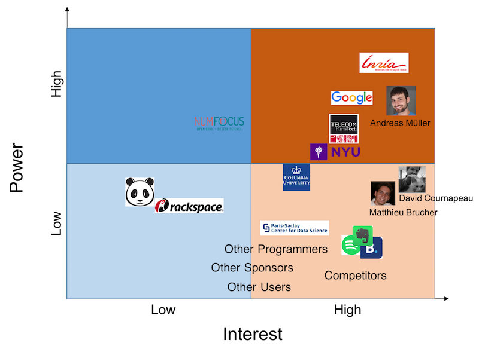
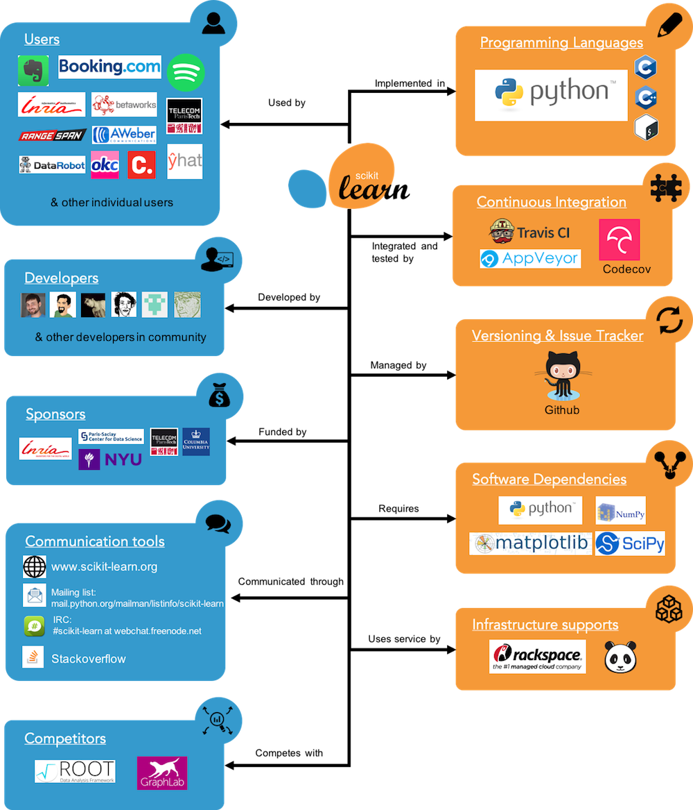
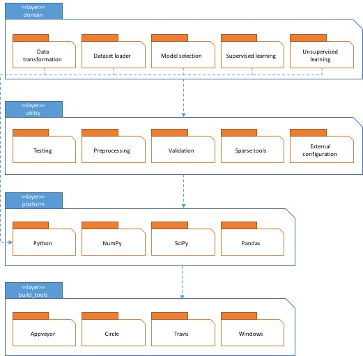
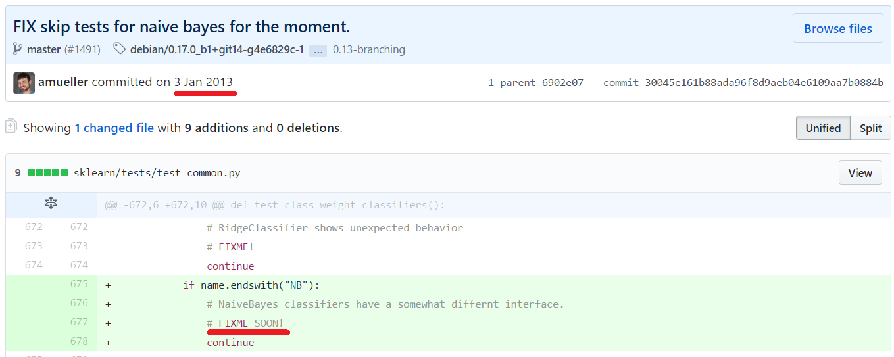

# Scikit learn {#scikit-learn}

By [N.Bakker](https://github.com/i-am-xhy), [R.Kharisnawan](https://github.com/romikharisnawan), [B.Kreynen](https://github.com/berndkr) and [C.M.Valsamos](https://github.com/harrisval)

_Delft University of Technology, 2016_


## _Abstract_ {#abstract}

_Scikit-learn started as a Google Summer of code project by David Cournapeau 9 years ago. Currently it is one of the most used libraries in python regarding machine learning due to its efficiency and simplicity. Despite its small size in its core team, external developers contribute daily to the project and the project keeps growing. Being passionate data scientists we were eager to explore its framework, and thus conducted a stakeholder analysis to see who is involved with scikit-learn. We then describe scikit-learn from various viewpoints and perspectives to understand its software architecture. Finally, this chapter closes with the analysis of technical and testing debt._

## Introduction

This chapter describes scikit-learn from the software architecture perspective. Scikit-learn is an open source machine learning library in the Python programming language. It has been growing and becoming more popular because of its efficiency and simplicity in use. Also, the fact that it is an open source library makes scikit-learn not only used by companies but also by individuals.

The chapter starts with a stakeholder analysis of the scikit-learn library. In this section, stakeholders are identified and an analysis is given on how they influence the library. This is done through Rozanski and Woods' classification, an additional stakeholders analysis, and a power-interest grid analysis. In addition, the project integrators are also identified. The section is followed by software views, which consists of the context, development, and deployment view. In this section, scikit-learn is explored from different kind of views to give a better understanding on how the library works, both internally and externally. Perspective on computational performance gives further explanation on performance of scikit-learn as machine learning library. The next section is software debts, which discusses technical debt and testing debt. Lastly, the chapter is closed with the conclusion of the whole analysis.

# Stakeholders Analysis

## Core team members and contributors

In this subsection, stakeholder analysis is explained  based on a chapter in Rozanski and Woods' book; Software Systems Architecture: Working With Stakeholders Using Viewpoints and Perspectives Chapter 9 \[2\]. Stakeholders are classified into:

### Acquirers

Acquirers oversee the procurement of the system or product and foresee funding \[2\]. Some companies and institutions have provided funding or use scikit-learn. These will have to make decisions about the acquisition of scikit-learn and might expect a return on investment of some sort. Examples include INRIA \(Institut National de Recherche en Informatique et en Automatique\), Paris-Saclay Center for Data Science, NYU Moore-Sloan Data Science Environment, Télécom Paristech, Columbia University, Google, Tinyclues.

### Assessors

Assessors oversee the system's conformance to standards and legal regulations \[2\]. Contributors who review pull requests ensure that the proposed changes adhere to the standards of scikit-learn contributions. However, someone with the clear role of assessing legal regulations could not be identified.

### Communicators

Communicators explain the system to other stakeholders, provide training and create manuals \[2\]. Scikit-learn's website is the main communication tool where its content is also managed by contributors and maintainers. There are several communication channels besides the website, such as  Stack Overflow \[4\], a mailing list, and an IRC channel.

### Developers

Developers construct and deploy the system from specifications \[2\]. Contributors on GitHub are developers. Some of them are sponsored by the institutions and organizations mentioned in the acquirers section.

### Maintainers

Maintainers manage the evolution of the system when it is operational, they focus on developing documentation, instrumentation, debug environments, preservation of knowledge, .... \[2\]. This role is mainly performed by Andreas Müller who has the role of release manager\[1\] at the time of writing. Other maintainers are contributors in GitHub who are willing to maintain the documentation and code of the library.

### Production engineers

Production engineers design, deploy and manage the hardware and software environments in which the system will be built, tested and run \[2\]. Andreas Müller performs this role as a release manager. Staff in the companies who use scikit-learn can also fall under this category.

### Suppliers

Suppliers build and/or supply hardware, software or infrastructure to run the system \[2\]. They can also provide staff for its development or operation. Some of the suppliers of scikit-learn are:

* **Rackspace**: Provides cloud services for automatically building documentation \[1\].
* **Shining Panda**: Provides CPU time on continuous integration servers \[1\].
* **Github**: Provides hosting of version control.
* Acquirers of project: Some provide funding to developers, for example Columbia University \[1\].

### Support staffs

Support staff provides support to users when the system is operational \[2\]. Communicators and support staff are the same group of stakeholders in scikit-learn.

### System administrators

System administrators run the system once it is has been deployed \[2\]. As scikit-learn is a library used in python, it runs locally on whichever system the users wants to use it on. Therefore, system administrators are those people the users of scikit-learn appoint to do this task.

### Testers

Testers systematically test the system to see if it is suitable for deployment and use \[2\]. When an enhancement is proposed to scikit-learn via a pull request, high-coverage tests are required for them to be accepted \[3\]. In addition, continuous integration tools automatically run these tests to ensure they pass each PR as well.

### Users

Users are those who eventually use the system. Several examples of users are Spotify, betaworks, evernote, booking.com, AWeber, YHat, Research teams at INRIA, Télécom ParisTech. Scikit-learn is also suited for individual users who want to do research, or do a project involving data analysis.

## Additional Stakeholders

With the categorization of stakeholders in the method proposed by Rozanski & Woods \[2\], we can find relevant stakeholders for most categories. However, it is noticeable that many stakeholders appear in many different categories in some way. In this section, a new categorization of the stakeholders is introduced to make the categories more distinct and the roles less intertwined. This categorization is less generally applicable, since it's tailored to scikit-learn. The different categories are contributors, users, funders and competitors.

  
_Figure 1: Visualization of the stakeholder categories for scikit-learn._

### Contributors

The first category is the contributors category. These stakeholders consist of everyone who contributes on Github. In March 2017, there were 798 contributors on the Github repository of scikit-learn. They are actively involved in raising issues, development, documentation, maintenance, and testing of scikit-learn. They also help with roles that belong to the communicators and support staff in Rozanski & Woods, since the contributors also create tutorials and contribute on Stack Overflow, the mailing list, and IRC channel.

For this group, it is important that they collectively understand the architecture and functionality of scikit-learn. Since they maintain and develop the system, they are concerned with the maintainability, flexibility, documentation and preservation of knowledge of the library.

### Users

As opposed to the categorization by Rozanski & Woods\[2\], we do not make the distinction between acquirers and users. Due to the simplicity of acquiring scikit-learn, an acquirers category seems less relevant to scikit-learn.

The users of scikit-learn are the various companies and organizations who utilise scikit-learn. There are quite a few variations between the users of scikit-learn but overall users will be concerned with documentation and ease of use since they will want to know how to use the methods implemented in scikit-learn. Reliability and correctness will also be a big concern for the users of scikit-learn. Finally, they may also be concerned about the maintainability of code which implements scikit-learn as opposed to the maintainability of scikit-learn itself.

### Funders

Funding to scikit-learn can be in the material or monetary form. This category corresponds somewhat to the acquirers category of Rozanski & Woods\[2\]. Generally, they expect some type of return on investment but this can come in many forms. Research institutions, for example, might want to be able to influence the developtment of scikit-learn to benefit their research and might be interested in the knowledge gained from working on the development of scikit-learn. An example of this would be INRIA. Companies might also want to influence the development of scikit-learn through funding but might be more concerned with influencing it so that they can use it to get a return on investment. Finally, companies like Rackspace and Shining Panda, who provide free services, might be interested in the publicity gained from working with scikit-learn.

### Competitors

Competitors to scikit-learn are other libraries which provide machine learning methods. Their developers could be interested in the development of scikit-learn to see which methods of scikit-learn they can utilize as well. However, they have very little influence on the development of scikit-learn. Examples of competitors are GraphLab \[25\] \(machine learning library in C++\) and ROOT \[26\] \(data analysis framework in C++\).

## Project Integrators

The project integrators are those people whose job \(or volunteered work\) it is to guarantee different qualitative properties and validate changes to the project. On March 2017, there were 40 people that have the capability of doing this\[5\].

These integrators face a specific set of challenges for scikit-learn. Starting with scikit-learn being a very theory heavy project, which is reflected by the length of discussions on issues. The discussion are often about whether pull requests are properly implementing the expected theory correctly. Examples are PR 8253 \[6\] and PR 8280 \[7\].

Because of this complexity, they also need to handle their Integrators with extra scrutiny, requiring two of them to write off on each and every pull request. Integrators also use automated testing and demand high coverage before accepting pull requests. The process is done to further guarantee the quality under pull request checklist \[8\].

## Power-interest grid

Figure 2 shows the quadrants of power and interest of scikit-learn stakeholders. The x-axis determines interest of stakeholders to scikit-learn which is divided into low and high interest. The interest of stakeholders is demonstrated by their willingness to explore, use, or contribute to the library. Contributions could be in the form of funding or taking part in development. The y-axis determines the power of stakeholders which is also divided into low and high power. Power is related to how influential the stakeholder is in scikit-learn's past, current, and future development. Therefore, the most powerful entities are in the upper-right quadrant and the least powerful ones in the opposite lower-left quadrant. As an example, Andreas Müller is in the upper-right quadrant because he has been the release manager since 2016, which indicates his high interest and influence in the development process. On the other hand, David and Matthieu were founders of scikit-learn \[1\] but they are not active in the development any more. Thus, they are classified in the high interest and low power area.

  
_Figure 2: Power-Interest grid._

# Views

In this section, we describe three views on the scikit-learn architecture: context, development, and deployment view. A view can be seen as a model of the architecture, with each view capturing different aspects of the architecture.

## Context View

This section contains the relationship between scikit-learn and other related entities. It helps to identify the purpose of the system and to understand its relationship with the environment.

### **Design Philosophy**

Scikit-learn was developed to provide easier implementation of data analysis methods, so individuals without much prior knowledge can use it. As a machine learning library, it provides several techniques in both supervised and unsupervised learning. Also, to make the library easy-to-use, scikit-learn provides examples of implementations and datasets. It is important to provide standardized datasets, not only for showing implementation examples, but also to provide training data to create classifiers. Additionally, a machine learning library will not be a useful library without visualization. Therefore, there are visualization examples to illustrate the performance of a classifier by using matplotlib as a basis of visualization.

### **Diagram**

Figure 3 describes the relationship between scikit-learn and its environment. It consists of ten external entity types which are related to scikit-learn. Each entity has a specific relationship to the library, for example users use scikit-learn or GitHub manages versioning and issue tracking for scikit-learn. Each specific entity inside an entity type may have a different weight of closeness to the library depending on their interactions, for example INRIA may have a stronger relation compared to Paris-Saclay Center for Data Science because they are still sponsoring scikit-learn at the time of writing.



_Figure 3: Context View._

## Development View

The development view is what gives developers \(and testers\) a birds eye view of the architecture. It should not be too detailed or descriptive, but still cover the most important bases.  
The development viewpoint discussed here is about scikit-learn's module structure model.

### Module Structure Model

The module structure model defines the organization of the system’s source code and related external systems, in terms of the modules into which the individual source files are collected and the dependencies among these modules \[2\]. In Figure 4 layers are identified for scikit-learn with each layer consisting of one or more module\(s\). These layers are:

* Domain layer: consisting of all main functionality modules: data transformations \[29\], data loader \[30\], model selection \[31\], supervised learning \[32\], and unsupervised learning \[33\].
* Utility layer: consisting of modules that support basic functionality that can be used in domain layer, such as testing, validation, preprocessing, sparse tool, and external configuration.
* Platform layer, which contains modules of the required packages, such as python \[34\], NumPy \[35\], and SciPy \[36\].
* Build tool layer, which contains build modules \[37\] to build the library. Each module consists of files to download, install, testing, or setting the required library.
  Dependency of one layer to the other layer\(s\) is demonstrated by a dashed arrow which points to the destination of the required layer. As an example, the utility layer uses all libraries available from python, NumPy, SciPy, and Pandas by importing them in the module. In addition, there are explicit intermodule dependencies for all modules in the domain layer for python because all files under each module requires python.

  
_Figure 4: Modules Structure Model._

This model answers the first concern of Rozanski and Woods addressed by the development view \[2\] by giving a better understanding of the module organization. Each module consists of hundred, possibly thousands, of source files and even more lines of code, which are used to implement libraries or functional elements. As a software architect it is useful to know the generic view of a system before going too much into detail. By analyzing through this model, we understand better in which way scikit-learn has been managed and the depencies between modules are clearly highlighted. In this library, a module is usually representated by a folder in the sklearn directory\[9\].

Another good thing that can be inferred by this model is how to arrange code in a logical structure. Thereby, it will help to manage dependencies and cultivate a better understanding with developers of these interdependencies without affecting other modules in unexpected ways.

## Deployment view

The deployment view is what looks into how the program is expected to operate in live operation. It will show what "hidden" dependencies scikit-learn has, it's runtime environment and lastly the required specialist knowledge for \(parts of\) scikit-learn.

  
_Figure 3A: the deployment view for scikit-learn_

### Dependencies

Running a scikit-learn instance requires several supporting libraries and programs \[10\]. These are, at the time of writing:

* Pip, while not a hard demand, in general is the way scikit-learn gets installed
* Conda, an alternative to pip to install scikit-learn
* Python, \( &gt; =2.6 or &gt; =3.3\) scikit-learn requires an instance of python to run it's scripts.
* NumPy \(&gt;=1.6.1\)
* SciPy\(&gt;=0.9\)

there are some technology compatibility conflicts between pip/conda and the required libraries. As the former tends to compile from source whereas the libraries tested are the provided binaries. Which can lead to differences.

### Runtime environment

As scikit-learn runs entirely within a single system, and on this system it runs inside python. Most of its runtime environment is either highly simplified or defined by its hosting programs.

* A computing system \(computer/phone etc.\) with support for python \(&lt;1GB hdd space and a supporting processor architecture, preferably a bit of ram as well \(say 128MB+\)\)
* the prerequisites mentioned in dependencies

These limits are, however, rather unrealistic when using scikit-learn. As in most cases, scikit-learn is used on rather large datasets, which would increase RAM/HDD usage accordingly.

### Specialist knowledge

To use Scikit-learn\('s full potential\) a lot of specialist knowledge is required. These required types of specialists are people a major company may want to have before adopting scikit-learn.

* Linear algebra, practically a demand for using scikit-learn as it is used almost everywhere that constitutes actual functionality. In addition, it is often a prerequisite for the other knowledge areas.
* Machine learning, scikit-learn allows use of neural network techniques, k-means and other techniques to provide most of its functionality.
* Set/collection theory, operations on and properties of sets are \(implicitly\) used as the basis for certain operations \(such as biclustering, mean\_shift and kmeans\)

# Perspective

## Computational performance perspective

One of important perspective of implementing machine learning library is computational performance. There are two computational performance metrics that can be used: latency and throughput at prediction time. Optimization is usually done to minimize latency and maximize throughput but it can hurt prediction accuracy.

### Prediction latency
Prediction latency is measured as the elapsed time necessary to make a prediction (e.g. in micro-seconds) \[38\]. There are four main factors that influence the prediction latecy: number of features, input data representation and sparsity, model complexity, feature extraction.
Number of features affects memory consumption, which shows number of basic operations, such as multiplications for vector-matrix products. Matrix of M instances with N features will result O(NxM) space complexity.
In sparse input data representation, optimization using sparse format is essential to make performance better by not storing zeros which will lead to less memory consumption. As a rule of thumb you can consider that if the sparsity ratio is greater than 90% you can probably benefit from sparse formats \[38\].
Model complexity will lead to more predictive power and latency. Increasing predictive power is usually interesting, but for many applications we would better not increase prediction latency too much \[38\].
In many real world applications the feature extraction process (i.e. turning raw data like database rows or network packets into numpy arrays) governs the overall prediction time \[38\]. In many cases it is thus recommended to carefully time and profile your feature extraction code as it may be a good place to start optimizing when your overall latency is too slow for your application.

### Prediction throughput
Prediction throughput is defined as the number of predictions the software can deliver in a given amount of time (e.g. in predictions per second) \[38\]. There are several ways to improve prediction throughput, such as spawn additional instances that share same model or add more machines to spread the load.


# Software Debts

There is an increasing amount of danger of not being able to add or enhance features as the project evolves. Technical debt needs to be looked at from the start of the project because small issues can lead to bigger problems later in the development of the project.

## Technical debt

Although, there is extensive maintenance from the beginning of the project, technical debt is still evident in the project as we are going to point out in this section. Several aspects regarding technical debt will be covered.

### Solid principles

For identifying technical debt, a good method is to look into the SOLID principles and how these are handled for scikit-learn. These principles could give an indication of arguably bad design being used, preventing or making it more difficult to make changes in the future.

#### Single Responsibility Principle

The Single Responsibility Principle states that a class should only have a single responsibility \[27\].

Whether this principle is broken in a widespread manner is difficult to say for scikit-learn due to the size of its code base. In general, all classes such as neural networks \[51\], kdtree \[53\] and label propagation \[20\] model a certain specific theory, and therefore tend to model this in a rather direct way.

This is a fine way to separate concerns, given one important assumption: The theory either does not change or a change in theory fundamentally requires a new class. For instance, a new theory is not an update of the old, therefore requires a new class.

```python
class email:
    function setSender(email_as_string)
```

_Figure 5: A bad implementation of single responsibility principle._

```python
class email_address:
   function getAddress():
       return this.address

class email:
    function setSender(email_as_email_address):
        this.address = email_as_email_addres.getAddress()
```

_Figure 6: A proper separation of concerns, this allows for example checking of format of an email in the constructor of the email\_address class._

This is also mostly true for places where modularization breaks down or other problems exist, as will be addressed further in this chapter, such as utils. the mocking file \[19\] is responsible for mocking functionality, and arrayfuncs \[18\] provides functions for arrays.

There are probably still splits that are possible, but the division of responsibilities makes a lot of sense for what scikit-learn is trying to do.

### Open/Closed Principle

The Open/Closed Principle states that software entities should be open for extension, but closed for modification.

```python
class drawer:
    drawCircle():
    drawSquare():
    drawShape(x):
        if(isinstance(x, circle):
            drawCircle()
        else:
            drawSquare()

class shape:

class circle(shape):

class square(shape):
```

_Figure 7: Example of bad application of the open/closed principle, drawer needs knowledge about every extending class. requiring changes for each new class implementing shape._

```python
class drawer:
    drawShape(x):
        x.draw()

class shape:
    draw(): # python does not have interfaces, but duck-typing.

class circle(shape):
    draw():

class square(shape):
    draw():
```

Figure _8: A good implementation of the open/closed principle, drawer can simply take any new implementation of shape as well._

For implementations that have similar roots \(such as neural networks \[15\]\) a parent class will be made defining basic behaviour that does not depend on specifics of the child to be useful. This closes the parent class, but keeps the child class open for extension

#### Liskov Substitution Principle

The Liskov Substitution Principle states that if S is a subtype of T then objects of type T may be replaced with objects of type S

```python
class rectangle:
    setHeight(self,x):
        self.height = x

    setWidth(self, x):
        self.width = x

    getArea(self):
        return self.width*self.height

class square(rectangle):
    setHeight(self,x):
        self.height = x
        self.width = x

    setWidth(self,x):
        self.height = x
        self.width = x

s = square()
s.setWidth(10)
s.setHeight(5)
print(s.getArea) # no valid expectation on area (either 25 from square, or 50 from rectangle)
```

_Figure 9: Bad implementation of Liskov substitution principle, square has additional restrictions on it that rectangle does not have, leading to weird situations when functions for rectangles get called on it._

This principle does not seem to be violated in scikit-learn. Lower classes do not tend to introduce additional restrictions and can replace their parent class where necessary. This is also because scikit-learn tends to implement proper duck-typing, which -when done properly- ensures the Liskov Substitution Principle.

Duck-typing says that the suitability of a certain class S to replace T is that it should offer at least the same functionality as T. i.e. "If it walks like a duck and quacks like a duck, it must be a duck." \[16\].

#### Interface Segregation principle

The Interface Segregation Principle states that no client should be forced to depend on methods it does not use.

This is again true because scikit-learn applies good duck typing. A duck does not talk, therefore its parent classes will not demand this of it.

This could also be explained as being caused by using python, as it does not support interfaces, fundamentally ignoring this principle. And therefore any program written in python is incapable of applying it \[28\].

#### Dependency Inversion Principle

Dependency Inversion Principle states that high level modules should not depend on low level modules, but instead both should depend on abstractions. Furthermore, abstractions should not depend on details but details on abstractions.

This does happen on occasion inside scikit-learn for example multilayer perceptron\[17\] creates a LabelBinarizer, meaning it is now dependent on how LabelBinarizer works for its own behaviour. Instead of passing a LabelBinarizer through the constructor.

```py
if not incremental:
            self._label_binarizer = LabelBinarizer()
            self._label_binarizer.fit(y)
            self.classes_ = self._label_binarizer.classes_
```

_Figure 10: Example of breaking Dependency Inversion Principle._

Reducing these kinds of instances could reduce the amount of technical debt, because it would be easier, and more explicit, when the class is passed through the constructor to change the specific class delivering the functionality in case a NewBetterLabelBinarizer class is required.

### Debt From Structure

Scikit-learn has several different ways of formatting its code. It uses both the classes and their respective imports \[17\].

```python
# filename: duck.py
class duck
    def quack():
        return 'Quack!'
```

_Figure 11: Example of new importing._

```python
from duck import duck
whatDoesTheDuckSay = duck().quack()
```

_Figure 12: Another example of new importing._

and defs with file based imports

```python
# filename: duck.py
def quack:
    return 'Quack!'
```

_Figure 13: Example of old importing._

```python
import duck
duck.quack()
```

_Figure 14: Another example of old importing._

This means different files function differently for the same type of functionality, possibly restricting flexibility and this could therefore be seen as technical debt.

### Debt From Modularization

For the most part scikit-learn has a logical document structure. An important exception to this is the utils folder, which seems to contain a lot of very different modules such as math \[21\], testing \[22\] and array functions \[23\]. This might make it more difficult to find specific functionality, increasing technical debt.

### Discussion of Technical Debt - In the Source Code

This section will look at how the contributors of Scikit-learn discuss technical debt. In some projects \(maybe even most\) occasionally technical debt is being discussed in the source code itself. This is often in the form of _TODO_ or _FIXME_ comments. In general, we find this a bad way of discussing technical debt as it is often forgotten about. However, in Scikit-learn it still happens occasionally.

We used grep to look for any _TODO_ or _FIXME_ comments in the whole Scikit-learn repository \(this includes the documentation\). The following commands were used in the root directory of the scikit-learn repository:

> grep -r  "FIXME" . --ignore-case  
> grep -r  "TODO" . --ignore-case

_Figure 15: Grep commands._

We found 76 occurrences of _TODO_ comments, spread out over 48 files. Four of these files are documentation files, but these have two purposes. Sometimes a _TODO_ is added in the documentation to indicate that a feature for example should still be implemented in the code, other times it actually means that something is missing in the documentation. We found 20 occurrences of _FIXME_ comments, spread out over 16 files, 2 of which are documentation files and 4 test files. The fact that there are both _FIXME_ and _TODO_ comments in the testing and documentation code indicates some form of testing and documentation debt present in the project.

The following picture sums up how well this method works for discussing technical debt:

  
_Figure 16: “FIXME” comment added long ago, which is still present in the code now._

### Testing debt

#### Code Testing

The code coverage for scikit-learn on 16 March was 94.76% which is very good. We can see a breakdown of the code coverage for different modules in the barplot in Figure 17. The full information can be found here \[24\]. Despite having modules where the code coverage is low\(e.g. datasets\) overall the system is tested very well.

The major contributors of scikit-learn have agreed upon approximately 90% coverage. Also, the project is well tested by implementing unit-testing. Unit testing as the developers in scikit-learn mention is "a corner-stone of the scikit-learn development process" \[2\].

We have also made a barplot where it is easier to see the different coverage scores for the different modules. We can identify the big difference of code coverage between the datasets module and the other modules.


_Figure 17: Code coverage about different modules ordered._

In addition, the project of scikit-learn relies on integration testing services like Travis CI \[14\], circleci \[12\] and AppVeyor \[13\]. It is a common procedure of the scikit-learn testing procedure to report the results of tests on continuous integration \(CI\) platforms. We can see an example of successful and unsuccessful testing on a PR in the figure below. All PRs need to pass all five check tests from different CI platforms before it gets merged: ci/circleci, codecov/patch, codecov/project, continuous-integration/appveyor/pr, and continuous-integration/travis-ci/pr. Thus, all changes in scikit-learn are well-tested and it reduces the risk. Also, it helps the reviewers to make decisions about which PR should be merged and to give constructive advice to the authors in order to fix PR.

  
_Figure 18: Tests on different CI platforms._

**Testing results on CI platforms.**

As is mentioned above, unit testing is also performed with the nose package \[15\]. The tests are functions with appropriate names, located in tests subdirectories. The tests check the validity of the algorithms and the different options of the code. The full scikit-learn tests can be run using 'make' in the root folder. Alternatively, running 'nosetests' in a folder will run all the tests of the corresponding subpackages. The code coverage of new features are expected to be at least around 90%.

#### Proposal for Removing Debt

It is dangerous to have this form of technical debt in a place where contributors might be less aware of it. To remove this form of technical debt we would firstly propose to keep track of it in a better way, so that the advantage of being an open source project can be utilized better to get rid of it. In issue 8581 \[11\] we proposed the following work-flow to remove it:

1. Create an issue on GitHub for each file still containing TODOs/FIXMEs.
2. File by file create issues for each TODO/FIXME comment.
3. Either remove the comments in a new PR linking the newly created issues or if it is preferable to keep the comments in the code as well, instead of removing the comment add a link to the issue in the comment.

This issue attracted the attention of a couple developers in scikit-learn. They highlighted that this is tedious work and it is more preferable to focus on existing issues. Also, these TODO/FIXME comments require expertise not currently available in the project.

# Conclusion

In the beginning of the chapter the different stakeholders of scikit-learn were introduced. Initially, the categories as defined by Rozanski & Woods were used, but using four main categories of stakeholders were more applicable to scikit-learn, which are contributors, users, funders and competitors. This section was followed by the views sections where three different aspects of the architecture were discussed through the use of the context view, the Development View and Deployment View. The Development View consisted of the Module Structure Model. The Module Structure Model identified the structure of the code in terms of how the code was grouped into modules. Finally, the Deployment View looked at the system in operation. It identified dependencies required to run and install scikit-learn, the environment needed to run it in and it also identified the need for specialist knowledge to utilize scikit-learn to it's fullest. The perspective on computational performance is the additional section to explore more about performance of scikit-learn as machine learning library. The last section looked at two main aspects of software debt, technical and testing debt. It started off with a section about looking at technical debt through the SOLID principles. This concluded that the SOLID principles are not fully applicable to this project due to using Python.  In this section, we also found that one prominent form of technical debt were _TODO_ and _FIXME_ comments. To mitigate this debt, we proposed a work-flow for adding these issues to GitHub one by one so that they could be tracked and solved more easily. Through our interactions with the scikit-learn contributors, we learned that they struggle with having enough expert knowledge to deal with these issues. When looking at the testing debt, it was evident that scikit-learn has high test coverage \(94.76%\) and that the contributors put in a lot of effort to keep this coverage high when reviewing pull requests. High test coverage really is a corner-stone of their development process. This is also noticeable when submitting a pull request since various continuous integration tools need to pass before a pull request can be approved.

## References

\[1\] [http://scikit-learn.org/stable/about.html\#people](http://scikit-learn.org/stable/about.html#people)

\[2\] Rozanski, \_Nick, and Eoin Woods. Software Systems Architecture: Working with Stakeholders Using Viewpoints and Perspectives.\_ Upper Saddle River, N.J.: Addison-Wesley, ©2012.

\[3\] [http://scikit-learn.org/stable/developers/contributing.html](http://scikit-learn.org/stable/developers/contributing.html)

\[4\] [http://stackoverflow.com/tags/scikit-learn/topusers](http://stackoverflow.com/tags/scikit-learn/topusers)

\[5\] [https://github.com/orgs/scikit-learn/people](https://github.com/orgs/scikit-learn/people)

\[6\] [https://github.com/scikit-learn/scikit-learn/pull/8253](https://github.com/scikit-learn/scikit-learn/pull/8253)

\[7\] [https://github.com/scikit-learn/scikit-learn/pull/8280](https://github.com/scikit-learn/scikit-learn/pull/8280)

\[8\] [https://github.com/scikit-learn/scikit-learn/blob/master/CONTRIBUTING.md\#user-content-pull-request-checklist](https://github.com/scikit-learn/scikit-learn/blob/master/CONTRIBUTING.md#user-content-pull-request-checklist)

\[9\] [https://github.com/scikit-learn/scikit-learn/tree/master/sklearn](https://github.com/scikit-learn/scikit-learn/tree/master/sklearn)

\[10\] [http://scikit-learn.org/stable/install.html](http://scikit-learn.org/stable/install.html)

\[11\] [https://github.com/scikit-learn/scikit-learn/issues/8581](https://github.com/scikit-learn/scikit-learn/issues/8581)

\[12\] [https://circleci.com/](https://circleci.com/)

\[13\] [https://www.appveyor.com/](https://www.appveyor.com/)

\[14\] [https://travis-ci.org/](https://travis-ci.org/)

\[15\] [http://nose.readthedocs.io/en/latest/](http://nose.readthedocs.io/en/latest/)

\[16\] [http://www.dictionary.com/browse/duck-typing](http://www.dictionary.com/browse/duck-typing)

\[17\] [https://github.com/scikit-learn/scikit-learn/blob/master/sklearn/neural\_network/multilayer\_perceptron.py](https://github.com/scikit-learn/scikit-learn/blob/master/sklearn/neural_network/multilayer_perceptron.py)

\[18\] [https://github.com/scikit-learn/scikit-learn/blob/master/sklearn/utils/extmath.py](https://github.com/scikit-learn/scikit-learn/blob/master/sklearn/utils/extmath.py)

\[19\] [https://github.com/scikit-learn/scikit-learn/blob/master/sklearn/neighbors/kd\_tree.pyx](https://github.com/scikit-learn/scikit-learn/blob/master/sklearn/neighbors/kd_tree.pyx)

\[20\] [https://github.com/scikit-learn/scikit-learn/blob/master/sklearn/semi\_supervised/label\_propagation.py](https://github.com/scikit-learn/scikit-learn/blob/master/sklearn/semi_supervised/label_propagation.py)

\[21\] [https://github.com/scikit-learn/scikit-learn/blob/master/sklearn/utils/extmath.py](https://github.com/scikit-learn/scikit-learn/blob/master/sklearn/utils/extmath.py)

\[22\] [https://github.com/scikit-learn/scikit-learn/blob/master/sklearn/utils/testing.py](https://github.com/scikit-learn/scikit-learn/blob/master/sklearn/utils/testing.py)

\[23\] [https://github.com/scikit-learn/scikit-learn/blob/master/sklearn/utils/arrayfuncs.pyx](https://github.com/scikit-learn/scikit-learn/blob/master/sklearn/utils/arrayfuncs.pyx)

\[24\] [https://codecov.io/gh/scikit-learn/scikit-learn/tree/603ff1a61d2d3d08624e18b32d05c177711d7299](https://codecov.io/gh/scikit-learn/scikit-learn/tree/603ff1a61d2d3d08624e18b32d05c177711d7299)

\[25\] [https://turi.com](https://turi.com)

\[26\] [https://root.cern.ch](https://root.cern.ch)

\[27\] \[[http://www.oodesign.com/single-responsibility-principle.html](http://www.oodesign.com/single-responsibility-principle.html)

\[28\] \[[https://www.python.org/dev/peps/pep-0245/](https://www.python.org/dev/peps/pep-0245/)

\[29\] [https://github.com/scikit-learn/scikit-learn/blob/master/doc/data\_transforms.rst](https://github.com/scikit-learn/scikit-learn/blob/master/doc/data_transforms.rst)

\[30\] [https://github.com/scikit-learn/scikit-learn/tree/master/doc/datasets](https://github.com/scikit-learn/scikit-learn/tree/master/doc/datasets)

\[31\] [https://github.com/scikit-learn/scikit-learn/blob/master/doc/model\_selection.rst](https://github.com/scikit-learn/scikit-learn/blob/master/doc/model_selection.rst)

\[32\] [https://github.com/scikit-learn/scikit-learn/blob/master/doc/supervised\_learning.rst](https://github.com/scikit-learn/scikit-learn/blob/master/doc/supervised_learning.rst)

\[33\] [https://github.com/scikit-learn/scikit-learn/blob/master/doc/unsupervised\_learning.rst](https://github.com/scikit-learn/scikit-learn/blob/master/doc/unsupervised_learning.rst)

\[34\] [https://www.python.org](https://www.python.org)

\[35\] [http://www.numpy.org](http://www.numpy.org)

\[36\] [https://www.scipy.org](https://www.scipy.org)

\[37\] [https://github.com/scikit-learn/scikit-learn/tree/master/build\_tools](https://github.com/scikit-learn/scikit-learn/tree/master/build_tools)

\[38\] [http://scikit-learn.org/stable/modules/computational_performance.html](http://scikit-learn.org/stable/modules/computational_performance.html)
